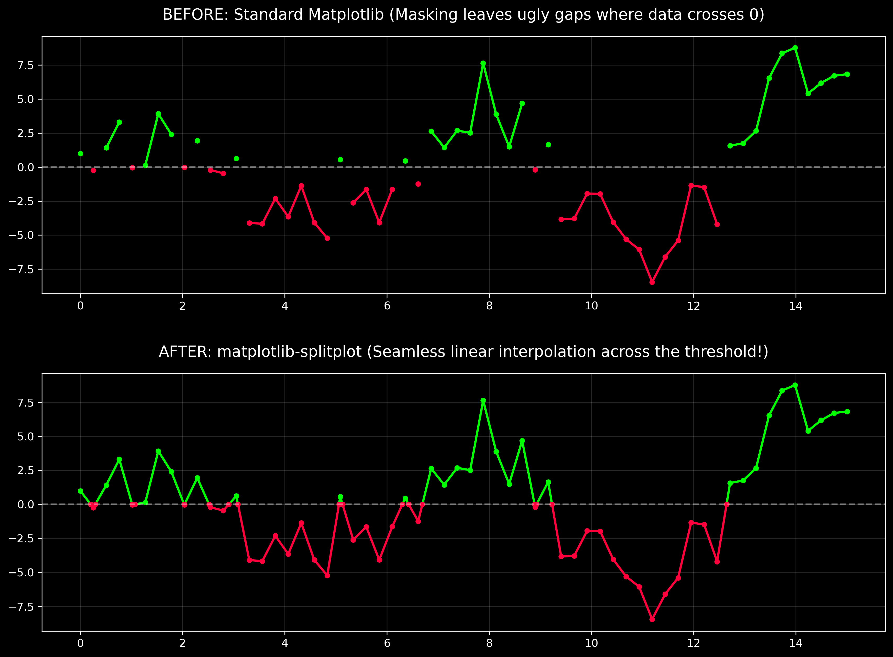

# Matplotlib SplitPlot 🎨📈

A lightweight Python library that solves one of Matplotlib's most frustrating limitations: **seamlessly changing the color of a single line when it crosses a specific threshold.**

[](https://pypi.org/project/matplotlib-splitplot/)
[](https://opensource.org/licenses/MIT)

---

## 🛑 The Problem vs. 🟢 The Solution

Because standard Matplotlib draws lines strictly from point A to point B, a line segment can only be a single color. If you try to use masked arrays to change colors above and below a threshold (like y=0), Matplotlib drops the line completely, leaving ugly gaps in your graph.

**`matplotlib-splitplot` fixes this.** It uses linear interpolation under the hood to calculate the exact mathematical intersection of your data and the threshold, injecting a new coordinate so the colors transition perfectly without any gaps.



## Installation

Install directly from PyPI:

```bash
pip install matplotlib-splitplot
```

## Quick Start

It works as a drop-in replacement for standard `ax.plot()` commands. Just pass your axes, your x/y data, and your colors.

```python
import numpy as np
import matplotlib.pyplot as plt
from splitplot import plot_split_color

# Generate some data
x = np.linspace(0, 10, 50)
y = np.sin(x) * 5

fig, ax = plt.subplots(figsize=(10, 5))

# Plot with a split color exactly at y = 0
plot_split_color(
    ax=ax, 
    x=x, 
    y=y, 
    threshold=0, 
    color_above='green', 
    color_below='red', 
    linewidth=2
)

plt.axhline(0, color='black', linestyle='--')
plt.show()
```

## Advanced Features
Any standard Matplotlib `kwargs` (like `linewidth`, `alpha`, `linestyle`, `marker`) can be passed into the function and will be applied to both halves of the line. You can also set the threshold to any number, not just zero!

```python
plot_split_color(ax, x, y, threshold=75.5, color_above='blue', color_below='orange', linestyle=':')
```
